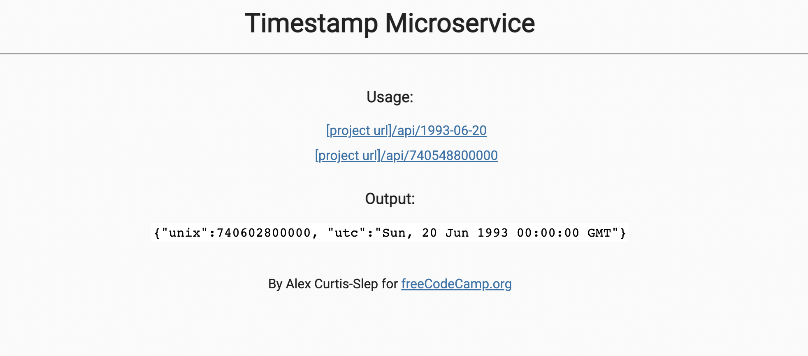
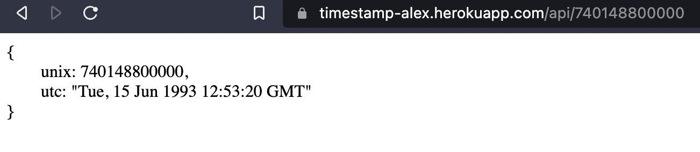
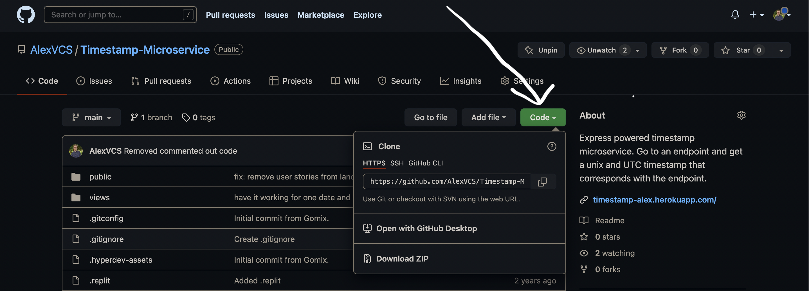

# [Timestamp Microservice](https://timestamp-alex.herokuapp.com/)

Node and Express powered Timestamp Microservice. Go to an API endpoint and get a unix and UTC timestamp that corresponds with the endpoint. Invalid dates return an error. This is a project I completed as part of the [Back End Development and APIs certification](https://www.freecodecamp.org/learn/back-end-development-and-apis/) from freeCodeCamp.

## Table of Contents
* [Screenshots](#screenshots)
* [Setup](#setup)
* [Technologies](#technologies)

### Screenshots

This is the homepage. The two links under usage are the API endpoints you can hit and edit as you wish.

<p align="center">
    
</p>

Here we're hitting an API endpoint. Take note of the URL after ```/api/```.  That's a millisecond timestamp. You can change the timestamp to a date such as 1984-02-12, or adjust the milliseconds.

<p align="center">
    
</p>

### Setup

Git, Node.js and NPM are required to run this project. Install Git by [following this](https://git-scm.com/book/en/v2/Getting-Started-Installing-Git). If you don't have Node and NPM installed please follow [these instructions](https://docs.npmjs.com/downloading-and-installing-node-js-and-npm) first.

1. Click the green code button:

<p align="center">
    
</p>

2. From there, click the button to the right of the URL under HTTPS. This will copy the URL of the repository.

3. Then open your terminal or command line. If you haven't used the command line before [learn how to here](https://www.theodinproject.com/lessons/foundations-command-line-basics).

4. If you've got a folder where you keep projects, change directories into that folder. After that type this command:

```git clone https://github.com/AlexVCS/Timestamp-Microservice.git```

This clones the repository to your local machine. It has a root directory called `Timestamp-Microservice` to store all the files.

5. Change directories into that folder:

```cd Timestamp-Microservice```

After that you can open the project in your text editor of choice. I use Visual Studio Code and launch it from the command line. [Learn how here](https://code.visualstudio.com/docs/setup/mac).

6. Once you have the project open, you need to install the dependencies. Run this in your command line from the root (mad-libzz folder) of the project:

```npm install```

7. After that finishes, run this to start the project:

```npm start```

8. Head to your browser of choice and type this into the address bar to run the project:

```localhost:3000```

### Technologies

* Node
* Express